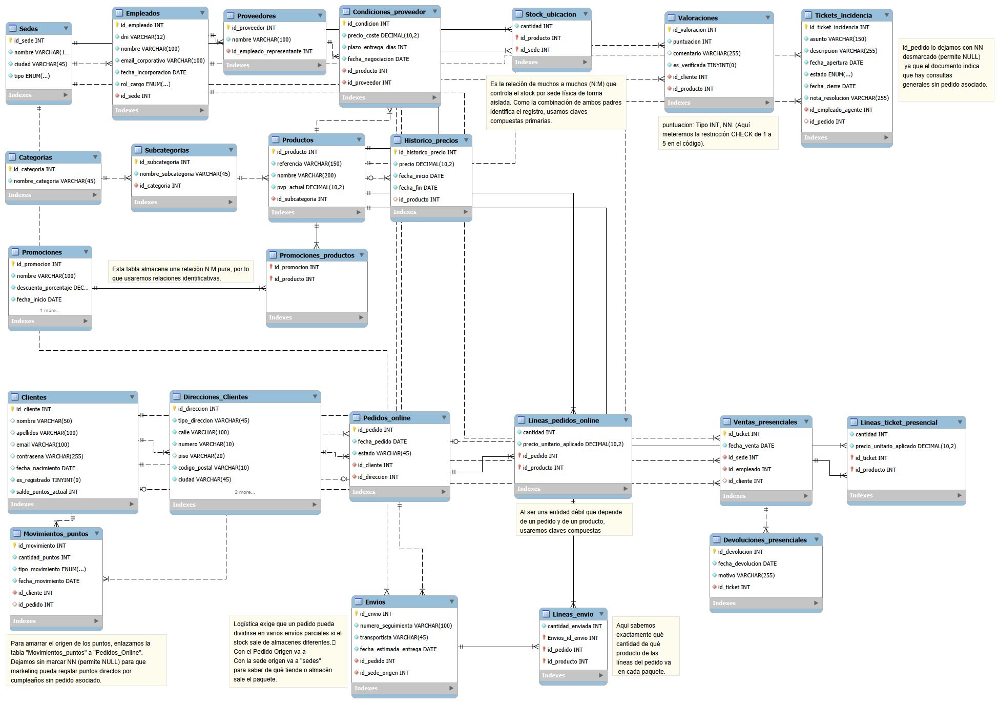

# 🛒 Proyecto NexShop Group S.A.
> **Diseño e Implementación de Base de Datos Relacional de Extremo a Extremo (Híbrido E-commerce / Retail)**

Bienvenido al repositorio oficial del proyecto final de bases de datos para **NexShop Group S.A.** Este desarrollo abarca desde el análisis conceptual inicial y el diseño del diagrama Entidad-Relación hasta la creación de scripts de optimización transaccional en MySQL Server.

---

## 👤 Información del Alumno
* **Nombre:** Sergio Barroso Milán
* **Curso:** 2º de Sistemas Microinformáticos y Redes (SMR)
* **Perfil de GitHub:** [@sergiobarrosomilan](https://github.com/sergiobarrosomilan)

---

## 🏢 Descripción de la Empresa
NexShop Group S.A. es una empresa de distribución y comercio minorista fundada en 2015 en Valencia y opera de manera híbrida integrando una potente plataforma e-commerce (*nexshop.es*) y una red de tres tiendas físicas situadas estratégicamente en Valencia, Madrid y Barcelona, gestionando un catálogo unificado de más de 2.000 referencias de productos organizados jerárquicamente.

---

## 📐 Diagrama Entidad-Relación (Fase 2)
El modelo de datos da soporte completo a la gestión de inventario por sedes, histórico de precios y condiciones de proveedores, sistemas de fidelización por puntos, valoraciones de productos, pasarela logistica con envíos parciales y tickets de incidencias.


*(Nota: El diagrama final en formato de imagen se encuentra guardado en la carpeta `docs/`)*

---

## 📂 Estructura del Repositorio
Siguiendo rigurosamente las pautas de entrega exigidas, los recursos están organizados de la siguiente manera:

```text
mi-proyecto-nexshop/
├── README.md               <-- Esta guía de presentación del proyecto
├── docs/
│   ├── memoria.pdf         <-- Memoria de análisis (Fase 1) y preguntas de reflexión
│   ├── diagrama_er.png     <-- Diagrama Entidad-Relación (Fase 2)
│   └── modelo_relacional.pdf <-- Notación relacional con PKs, FKs y restricciones (Fase 3)
└── sql/
    ├── schema.sql          <-- Estructura DDL (CREATE TABLE, restricciones, CHECKs)
    ├── datos.sql           <-- Script de inserción con datos de prueba realistas
    └── consultas/
        └── consultas.sql   <-- Batería de las 14 consultas SQL solicitadas y comentadas
